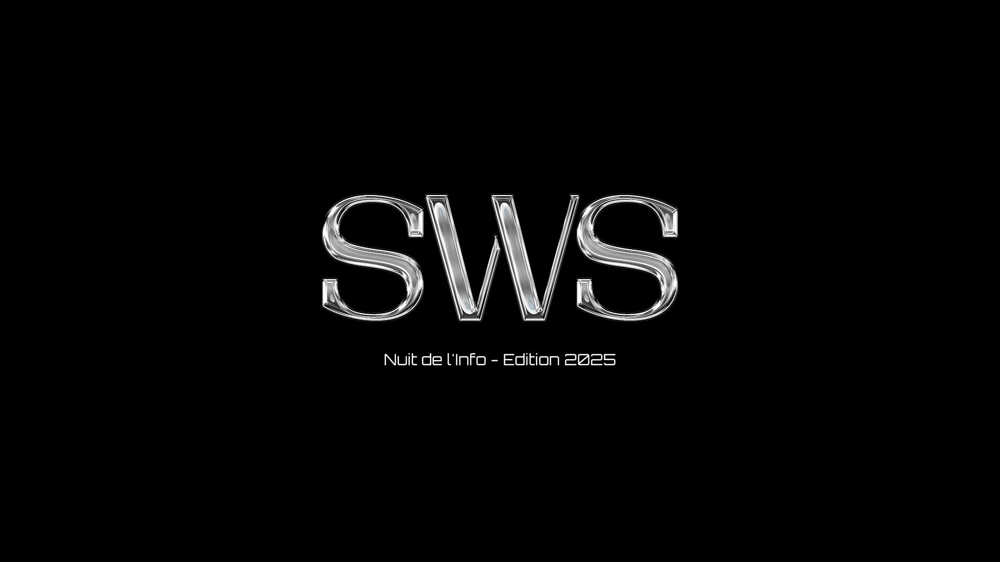

### Sommaire

- [Stack](#stack)
- [Démarrage](#getting-started)
- [À propos](#about-nuit-de-linfo)

### Stack

- [Bun](https://bun.sh) as the JavaScript runtime and package manager
- [Hono](https://hono.dev) as the backend framework
- [Vite](https://vitejs.dev) for frontend bundling
- [React](https://react.dev) for the frontend UI
- [Turbo](https://turbo.build) for monorepo build orchestration and caching

You can find [here](https://github.com/sws-corp/nuit-et-jour) the repo for the stack

### Getting Started

```bash
# Install dependencies
bun i

# Run development server
bun dev

# Build for production
bun run build
```

### About Nuit de l'Info

[La Nuit de l'Info](https://www.nuitdelinfo.com) is a French national hackathon where student teams compete to develop web applications in one night. Teams tackle a main challenge alongside various side challenges, combining technical skills, creativity, and teamwork under time pressure.

